# Agents of Chat: 30 Years of Chat & Agent Memory Evolution

## System Architecture

`Agents of Chat` demonstrates how the 30-year evolution of chat applications maps directly to the cognitive memory architectures of modern AI agent systems.

### Historical Era to Cognitive Memory Taxonomy

| Era | Year | Chat Paradigm | Cognitive Agent Memory Concept | Key Mechanisms & Invariants |
|---|---|---|---|---|
| **1** | 1988 | **IRC & Unix talk** | **Short-Term Memory (STM) & FIFO Eviction** | Volatile RAM ring buffer (5 turns). Demonstrates the *Amnesia Trap*: oldest conversational turns are permanently evicted upon overflow. Fullscreen green-on-black CRT terminal. |
| **2** | 1997 | **AIM & ICQ** | **Working Memory & Attentional State** | Stateful 1:1 session isolation. Agent presence (`available`, `away`, `typing`) represents attentional state; away messages dynamically prime agent persona/prompts. Classic Win95/98 window chrome with Buddy List. |
| **3** | 2006 | **Jabber & Scoped Rooms** | **Search Isolation & Context Fencing** | Domain-partitioned rooms. Enforces role-based permissions (`AllowedRoles`) to prevent associative bleed, prompt contamination, or permission leaks across rooms. Web 2.0 room tabs with quarantine warnings. |
| **4** | 2013 | **HipChat & Cloud Archive** | **Long-Term Memory (LTM): Vector Search RAG** | Persistent cloud archive and inbound webhooks. Autonomous agents perform exact cosine similarity retrieval on vector indexes without context stuffing. Classic aubergine sidebar with universal vector search bar. |
| **5** | 2017 | **Discord Forums & Threaded Chat** | **Sub-Task Scratchpads & Compaction** | Collapsible sub-task scratchpads keep main channel context clean. Scribe agent generates hierarchical state rollups reducing token consumption by 96%. Expandable right-hand thread drawer. |
| **6** | 2026 | **Collaborative Agent Mesh** | **Dual-Layer Memory, REM Dreaming & Crystalline Recall** | Modern multi-agent swarm with shared team blackboards alongside confidential private agent scratchpads (inner monologue + tool traces). Vertex AI Gemini 3.8 background dreaming prunes conversational noise, records intent trajectories, and crystallizes durable beliefs into long-term BigQuery vector storage for fast-path recall (<10ms). Academic sepia 3-panel layout with 5-tab Memory Lens drawer. |

---

## Dynamic Era UI Transformation Engine

The application frontend features a top navigation header (`TopEraBar`) containing:
1. **Prominent Top-Left Era Dropdown**: Instant jump to any of the 6 historical eras with rich metadata tags (year, platform, cognitive memory concept).
2. **Presentation Stepper Controls**: `< Prev Era` and `Next Era >` buttons allowing a speaker or presenter to step sequentially through the 30-year journey.
3. **Autonomous Pacing & Re-seed Controls**: Live conversation ticker pause/play toggle, pacing speed indicator, and talk re-seed action.

When an era is selected, the Flutter Web interface **literally transforms** into the authentic styling of that era:
- **1988 IRC (`IrcTerminalView`)**: Monospace phosphor CRT terminal (#33FF33 on #0A0D0A) with scanlines, no sidebars or drawers, volatile 5-turn FIFO RAM display, and live `[AMNESIA TRAP]` eviction banners.
- **1997 AIM (`AimMessengerView`)**: Windows 95/98 beveled window chrome with navy title bar, Buddy List with active agents, away message persona priming modal, and sunken 1:1 direct chat log with formatting bar.
- **2006 Jabber & Scoped Rooms (`ScopedRoomsView`)**: Web 2.0 cream aesthetic, project-scoped room tabs, sound toggle, yellow fade highlight, and real-time `CONTEXT QUARANTINE WARNING` cards for cross-room isolation.
- **2013 HipChat & Cloud Archive (`VectorArchiveView`)**: Aubergine sidebar (`#4A154B`), clean white transcript, and top universal Vector RAG search bar computing live cosine similarity distances.
- **2017 Threaded Chat (`ThreadsView`)**: Modern workspace with an interactive resizable right-hand Thread Scratchpad (resizable from left to right via a draggable splitter handle, quick preset buttons `Std: 430px`, `Wide: 650px`, full-width `Maximize`/`Restore`, and collapsible root prompt toggle), active thread highlighting in the main channel stream, and prominent `@scribe summarize thread` compaction button (-96% token rollup).
- **2026 Collaborative Agent Mesh (`AgentMeshView`)**: Academic sepia 3-panel studio (Swarm Roster with live presence, Blackboard stream with compact Intent Pills and Progressive Quick Action Scenario Chips, and 5-tab Memory Lens Drawer for private scratchpads, live Dreaming consolidation, and crystalline belief inspection). Features an automated 5-step interactive tour.

---

## API Reference

### Eras & Taxonomy
- `GET /api/eras`: Lists the 6 historical evolutionary eras with active feature flags.

### Channel Scoping & Buffer Telemetry
- `GET /api/channels`: Lists all domain channels with `EraID`, `MaxBufferTurns`, `AllowedRoles`, and `RetentionHours`.
- `GET /api/channels/{id}/buffer`: Retrieves volatile FIFO buffer metrics (`max_turns`, `current_turns`, `evicted_count`, and `last_evicted_msg`).
- `GET /api/channels/{id}/messages`: Retrieves messages for a channel or scoped thread (`?thread_id=...`).
- `POST /api/channels/{id}/messages`: Posts a user or system message, triggering agent evaluation.
- `POST /api/channels/{id}/events`: Injects an external webhook/monitoring event.

### Attentional Presence & Scratchpads
- `GET /api/presence`: Lists live agent statuses (`available`, `away`, `typing`), away messages, and tasks.
- `POST /api/presence`: Updates an agent's presence and status message.
- `GET /api/scratchpads?agent_id=...&channel_id=...`: Retrieves an agent's private inner monologue, draft plans, and raw tool traces.
- `POST /api/scratchpads`: Updates an agent's private scratchpad.

### Dreaming & Memory Consolidation (REM Sleep Pattern)
- `POST /api/channels/{id}/consolidate`: Triggers Gemini 3.8 offline REM dreaming pass to prune ephemeral noise, distill durable architectural facts, track intent trajectories, and crystallize structured beliefs.
  - **ConsolidationReport Schema**:
    - `pruned_messages`: Number of transient debug/chatter turns evicted from active context.
    - `distilled_facts`: Slice of durable architectural conclusions and invariant statements.
    - `insight_summary`: Synthesized consensus paragraph summarizing overall technical state.
    - `crystallized_beliefs`: Array of structured, high-confidence facts (`key`, `value`, `category`, `confidence`, `keywords`, `statement`).
    - `dream_prompt_used`: Complete prompt harness passed to Gemini 3.8 for full auditability.
    - `intent_trajectory`: Chronological progression across dialogue phases (e.g. Inception -> Design -> Hardening -> GA Sign-off).
- `GET /api/channels/{id}/reports`: Lists past memory consolidation reports including `crystallized_beliefs`, `dream_prompt_used`, and `intent_trajectory`.
- **Fast-Path Crystalline Recall (<10ms)**: Direct associative keyword and key-based cache query (`SearchCrystallizedBeliefs`) on Era 6 channels (`#chan-product-launch`) prepending `⚡ Crystalline Cache (<10ms)` (`crystalline_hit`) purple intent tags and bypassing expensive iterative generation cycles.
- **Multi-Layer Deduplication Guarantees**:
  - *Client Layer*: UI state management in Flutter (`upsertConsolidationReport`) indexes reports by deterministic ID, preventing the concurrent WebSocket broadcast and HTTP POST response race condition from inserting duplicate reports.
  - *Agent Mesh View Layer*: `AgentMeshView.extractCrystallizedBeliefs` deduplicates beliefs by normalized key (lowercase trimmed) and retains highest-confidence / recency entries. Consolidation run history renders strictly unique report cards.
  - *Orchestrator Layer*: `ConsolidateMemory` deduplicates newly synthesized beliefs by key prior to building the `ConsolidationReport` and removes redundant duplicate persistence calls.
  - *Memory Store Layer*: `SearchCrystallizedBeliefs` and `saveCrystallizedBeliefsLocked` enforce case-insensitive key deduplication across memory and persistence pipelines.
  - *BigQuery Layer*: `UpsertCrystallizedBelief` uses a deterministic `insertId` (`fmt.Sprintf("%s-%s", channelID, belief.Key)`), enabling BigQuery's native streaming buffer to automatically deduplicate writes within its 1-minute deduplication window, and `SearchVectorBeliefs` deduplicates candidate rows.

### 2026 Progressive Quick Action Scenario Pills & Guided Tour
- **Interactive Tour**: 5-step guided playback sequence stepping through Swarm Consensus, Private Scratchpad Isolation, REM Sleep Dreaming Consolidation, Crystalline Memory Inspection, and Fast-Path Crystalline Recall.
- **Pill 1 (Onboarding Stack)**: `Swarm consensus: Standardize deployment on Google Cloud Run, Terraform, and Google BigQuery with Gemini 3.8.`
- **Pill 2 (Security Boundary)**: `Security constraint: Zero-trust credentials, auth tokens, and raw tool traces must remain strictly isolated inside private scratchpads.`
- **Pill 3 (Trigger Dreaming)**: `POST /api/channels/chan-product-launch/consolidate`
- **Pill 4 (Recall Probe)**: `What deployment stack and security policies did the multi-agent swarm establish?`

### BigQuery Database & Vector Store Integration
- `GET /api/database`: Returns live status and schema telemetry for Google BigQuery and vector stores:
  - `database`: `"Google BigQuery"`
  - `project_id`: `"davenport-boutique"`
  - `dataset_id`: `"adk_agent_telemetry"`
  - `tables`: `["agent_logs", "session_summaries", "crystallized_beliefs"]`
  - `vector_engine`: `"BigQuery Vector Search (ML.DISTANCE COSINE)"`
  - `auth_type`: `"Google Cloud Application Default Credentials (ADC)"`
  - `total_crystallized_beliefs`: Count of active 768-dim vectorized durable beliefs.
- **BigQuery Vector Search**: Uses native BigQuery `ML.DISTANCE(embedding, query_vector, 'COSINE')` queries across 768-dimensional normalized float vectors on `adk_agent_telemetry.crystallized_beliefs`.
- **Asynchronous Telemetry Streaming**: Real-time non-blocking streaming of episodic conversation events to BigQuery `adk_agent_telemetry.agent_logs` and dream consolidation reports to `adk_agent_telemetry.session_summaries` via BigQuery REST `tabledata.insertAll`.

### Automated Playback CLI Runner
- **Script**: `scripts/demo_2026_flow.py` (Interactive multi-phase playback runner).
- **CLI Flags**: `--url` (defaults to Cloud Run service URL or local server) and `--auto` (delays between phases).
- **Execution Phases**:
  0. Phase 0: Database & BigQuery Vector Store Verification (Queries `/api/database` -> asserts `adk_agent_telemetry` and vector engine)
  1. Phase 1: Swarm Consensus (Posts Pill 1 -> asserts agent response and team blackboard state)
  2. Phase 2: Security Boundary & Private Monologue (Posts Pill 2 -> verifies Zero-Leakage Invariant)
  3. Phase 3: REM Sleep Dreaming Trigger (Invokes `/consolidate` -> verifies ConsolidationReport schema)
  4. Phase 4: Crystalline Memory Inspection (Validates crystallized beliefs with confidence >= 0.90)
  5. Phase 5: Fast-Path Crystalline Recall (Asserts purple `⚡ Crystalline Cache (<10ms)` tag)


### Autonomous Pacing & WebSocket
- `GET /api/pacing`, `POST /api/pacing`: Configures autonomous ticker loop interval and paused state.
- `GET /ws`: Real-time WebSocket streaming `new_message`, `agent_typing`, `presence_updated`, `buffer_evicted`, `consolidation_completed`, `scratchpad_updated`, `pacing_updated`, and `memory_telemetry`.

---

## Memory Architecture & Live Telemetry Drawer

Each historical era is paired with an interactive **Memory Architecture & Live Telemetry Drawer** (`MemoryArchitectureDrawer`), accessible globally across all 6 eras via the `TopEraBar` action button or a floating quick-access pill pinned to the right edge.

```
+-----------------------------------------------------------------------------------------+
|                                    TopEraBar                                           |
| [1988: IRC v]    [< Prev Era | 1/6 | Next Era >]    [Auto-Pacing] [Reset] [Architecture] |
+--------------------------------------------------------+--------------------------------+
|                                                        | Memory Architecture Drawer     |
|                                                        | [1988] Ephemeral Buffer (IRC)  |
|                                                        | Cognitive: FIFO Ring Buffer    |
|                  Era Main View                         +--------------------------------+
|           (IRC / AIM / Jabber /                      | [Architecture] [Code] [Trace]  |
|             HipChat / Threads / Mesh)                     |                                |
|                                                        | [Step 1] -> [Step 2]           |
|                                                        | [Step 3] -> [Step 4]           |
|                                                        |                                |
|                                                        | Pipeline Step Deep-Dive        |
|                                                        | Failure Mode & Production Code |
+--------------------------------------------------------+--------------------------------+
```

### 4-Tab Architecture Inspector

1. **Tab 1: Architecture (4-Stage Cognitive Pipeline Grid)**
   - Visual 4-stage pipeline graph showing data transformations, flow tags, and active step execution using modern cognitive agent concepts (Sliding Token Contexts, Attentional Liveness, Context Fencing, Vector Search RAG, Hierarchical Compaction, Dual-Layer Memory & Dreaming).
   - Interactive step selection displaying **Step Inspector**:
     - **Mechanism**: Technical breakdown of the memory data structure.
     - **Flow Tag**: Where data enters and leaves the stage.
     - **Failure Mode & Trap**: Demonstrates the real-world vulnerability (e.g. The Amnesia Trap, Session Crosstalk, Associative Bleed, RAG Context Dilution).
     - **Step Implementation Code**: Focused excerpt of production code executing this step.
   - Animated `LIVE` badge highlighting the step currently executing during real-time operations.

2. **Tab 2: Tradeoffs & Showcase Script**
   - **Cognitive Tradeoffs Matrix**:
     - Modern Agent Architecture Equivalent (e.g., Fixed-Window Context Buffer vs. Hierarchical Compaction).
     - Key Architectural Benefits (low latency, strict security boundaries, O(1) retrieval).
     - Cognitive Drawbacks & Failure Modes (The Amnesia Trap, Context Fragmentation, Swarm Split-Brain).
     - 2026 Production Verdict evaluating suitability for production agent systems.
   - **Interactive Presenter Showcase Script**:
     - Sequential stage chapters for live demonstrations.
     - "Speaker Says" callout with verbatim presentation script.
     - "Audience Observation" callout highlighting exact telemetry cues.
     - One-click **Run Step Live** action triggers that execute real backend operations (`action-era1-overflow`, `action-era2-test-boundary`, `action-era3-trigger-quarantine`, `action-era4-vector-query`, `action-era5-compact-thread`, `action-era6-trigger-dreaming`).

3. **Tab 3: Production Sample Code & Schemas**
   - Syntax-highlighted production code tabs:
     - **Primary Language Implementation** (e.g. Go concurrency loops, Rust circular buffers, Python orchestration).
     - **DDL / Storage Schema** (e.g. BigQuery vector schemas, PostgreSQL JSONB schemas, C memory structs).
   - One-click **Copy Code** action with visual feedback.

4. **Tab 4: Live Telemetry Trace & Payloads**
   - Real-time execution span stream showing:
     - Action tags (`FIFO_EVICT`, `SESSION_BOUNDARY_CHECK`, `FIREWALL_QUARANTINE`, `VECTOR_SCAN`, `SCRIBE_COMPACT`, `DREAMING_PASS`).
     - Step indicator (`STEP 1`..`STEP 4`).
     - Execution latency (e.g. `⏱️ 14ms`).
     - Metric chips (e.g. `Displaced: 1`, `Cosine Dist: 0.12`, `Tokens: 120`).
     - Expandable formatted JSON payload previews.
   - For Era 2026, an on-demand **Trigger REM Dreaming Pass** button triggering offline Gemini 3.8 memory consolidation.

---

## Cognitive Boundary Isolation Invariants Across All 6 Panes

To prevent cross-agent crosstalk and unauthorized associative memory leaks, strict boundary invariants are enforced across all 6 panes:

| Era | Architectural Boundary | Isolation Invariant | Security & Quarantine Enforcement |
|---|---|---|---|
| **Era 1 (1988 IRC)** | Ephemeral RAM Ring Buffer | Strict 5-turn FIFO capacity; evicted turns are purged immediately from working memory. | `FIFO_EVICT` span triggers upon Turn 6; evicted credentials cannot be recovered or referenced. |
| **Era 2 (1997 AIM)** | 1:1 Direct Message Sessions | Complete bilateral working memory isolation. Agents have ZERO visibility into peer DM channels. | `SESSION_BOUNDARY_CHECK` span quenches cross-agent inquiries; direct messages lock target role and ignore hijack attempts. |
| **Era 3 (2006 Jabber)** | Role-Based Room Firewalls | Context fencing via `AllowedRoles`. Unprivileged agents cannot access confidential executive domains. | `FIREWALL_QUARANTINE` span blocks unauthorized cross-tenant queries at the boundary. |
| **Era 4 (2013 HipChat)** | Channel-Scoped Vector RAG | Cosine similarity search scoped strictly to channel domain; non-vector eras bypass vector search entirely. | Embeddings partition search space; returns sub-10ms historical ADR precedents without context stuffing. |
| **Era 5 (2017 Threads)** | Sub-Task Scratchpad Isolation | Ephemeral sub-task deliberations remain isolated in child threads until explicitly compacted. | `SCRIBE_COMPACT` creates a 96% token rollup into the root channel, keeping root context pristine. |
| **Era 6 (2026 Agent Mesh)** | Dual-Layer Public/Private Memory | Private scratchpads (inner monologue, tool traces) are confidential and never leak into team blackboards. | Offline Gemini 3.8 REM dreaming synthesizes shared blackboard knowledge while preserving private scratchpad boundaries. |

---

## System Data Flow Architecture

The following diagram illustrates the complete, physical and logical end-to-end data flow of `Agents of Chat` across ingestion, in-memory working buffers, Gemini 3.8 inference, BigQuery persistence, and offline crystalline memory consolidation:

```mermaid
flowchart TD
  subgraph Ingress["1. Ingress & Triggers"]
    UI["Web Client / Chat UI"] -->|HTTP POST /messages| API["Go HTTP API Gateway (:8080)"]
    Webhooks["Inbound Sensor / Alert Webhooks"] -->|HTTP POST /events| API
    CronTicker["Autonomous Pacer (1.5s - 12s)"] -->|Tick Trigger| API
  end

  subgraph WorkingMemory["2. In-Memory Working State (RAM)"]
    API -->|Route by Era & Channel| Store["MemoryStore (Thread-Safe Mutex)"]
    Store -->|Era 1988: 5-Turn Max| RingBuf["FIFO Ring Buffer\n(Oldest turn dropped -> Amnesia Event)"]
    Store -->|Era 1997: 1:1 DMs| DMContext["Isolated Session Context\n(Peer crosstalk blocked)"]
    Store -->|Era 2006: Room Scopes| RoomRBAC["Scoped Room Buffer\n(Role firewall check)"]
    Store -->|Era 2017: Sub-Tasks| ThreadBuf["Child Thread Scratchpad\n(Root context shielded)"]
    Store -->|Era 2026: Blackboard| TeamStream["Shared Team Blackboard"]
    Store -->|Era 2026: Agent Monologue| Scratchpad["Private Agent Scratchpad\n(Zero-Leakage confidential)"]
  end

  subgraph LLMInference["3. LLM Inference & Generation"]
    TeamStream & Scratchpad -->|Assembled Prompt (ADC Auth)| VertexAI["Google Cloud Vertex AI\n(gemini-3.8-flash)"]
    VertexAI -->|Generated Message + Intent Tags| TeamStream
    TeamStream -->|Broadcast Events| WSHub["WebSocket Event Fanout Hub"]
    WSHub -->|Live Streaming Telemetry| UI
  end

  subgraph TelemetryStorage["4. Real-Time Telemetry Persistence"]
    API & Store -->|Async REST Streaming| BQLogs[("BigQuery: agent_logs\nadk_agent_telemetry")]
  end

  subgraph OfflineDreaming["5. Offline Consolidation & Recall"]
    UI & API -->|POST /consolidate| DreamPass["REM Sleep Dreaming Engine\n(Gemini 3.8 Flash)"]
    TeamStream -->|Prune Noise & Extract Invariants| DreamPass
    DreamPass -->|Session Summaries| BQSummary[("BigQuery: session_summaries")]
    DreamPass -->|768-d Vector Embeddings| BQBeliefs[("BigQuery: crystallized_beliefs\n(Cosine Distance)")]
    BQBeliefs -->|Distilled Beliefs| Cache["In-Memory Crystalline Cache\n(Key-indexed, <10ms lookup)"]
    Cache -->|<10ms Fast-Path Zero-Token Recall| TeamStream
  end
```

---

## 4-Stage Cognitive Memory Pipelines across the 6 Eras

Each historical era implements a 4-stage data pipeline showing exactly how user messages flow through memory structures, where gates/firewalls evaluate permissions, and what triggers failure modes:

```mermaid
flowchart TD
  subgraph Era1["1988 IRC: Ephemeral Buffer"]
    E1_In["User Prompt / Command"] --> E1_Buf["Push to 5-Turn Circular Buffer"]
    E1_Buf --> E1_Evict{"Capacity > 5?"}
    E1_Evict -->|Yes| E1_Drop["Drop Oldest Turn (Amnesia Trap: FIFO_EVICT)"]
    E1_Evict -->|No| E1_Keep["Retain Turn in RAM"]
    E1_Drop & E1_Keep --> E1_Prompt["Assemble Working Context -> Phosphor CRT Terminal"]
  end

  subgraph Era2["1997 AIM: 1:1 Session Isolation"]
    E2_In["Direct Message to Buddy"] --> E2_Check{"Target Buddy == Session Agent?"}
    E2_Check -->|No| E2_Block["Quench Crosstalk (SESSION_BOUNDARY_CHECK)"]
    E2_Check -->|Yes| E2_Presence{"Agent Status?"}
    E2_Presence -->|Away| E2_Away["Prime Persona with Away Memo"]
    E2_Presence -->|Available| E2_Prompt["Assemble 1:1 Working Memory -> Win95 Chat Window"]
    E2_Away --> E2_Prompt
  end

  subgraph Era3["2006 Jabber: Role Firewalls"]
    E3_In["Post to #channel"] --> E3_RBAC{"Agent Role in AllowedRoles?"}
    E3_RBAC -->|No| E3_Quarantine["Block & Quarantine (FIREWALL_QUARANTINE)"]
    E3_RBAC -->|Yes| E3_Scope["Append to Scoped Room Context"]
    E3_Scope --> E3_Prompt["Assemble Fenced Prompt -> Web 2.0 Room Stream"]
  end

  subgraph Era4["2013 HipChat: Vector Search RAG"]
    E4_In["User Query / Inbound Webhook"] --> E4_Embed["Compute 16-d Semantic Embedding Vector"]
    E4_Embed --> E4_Search["Query Historical ADRs via Cosine Distance"]
    E4_Search --> E4_Inject["Inject Sub-10ms Vector Precedents into Prompt"]
    E4_Inject --> E4_Out["Ground LLM Generation -> Aubergine Stream"]
  end

  subgraph Era5["2017 Threads: Sub-Task Compaction"]
    E5_In["Sub-Task Investigation Message"] --> E5_Thread["Isolate inside Child Thread Scratchpad"]
    E5_Thread --> E5_Deliberate["Agents Deliberate (Root Stream Context Shielded)"]
    E5_Deliberate --> E5_Compact{"@scribe Compaction Triggered?"}
    E5_Compact -->|Yes| E5_Rollup["Roll Up Thread into Condensed Checkpoint (-96% Tokens)"]
    E5_Rollup --> E5_Root["Sync Checkpoint to Root Channel"]
  end

  subgraph Era6["2026 Agent Mesh: Dual-Layer Memory & Dreaming"]
    E6_In["Commander Direction"] --> E6_Team["Shared Team Blackboard (Public)"]
    E6_Team --> E6_Priv["Agent Private Scratchpad (Confidential Monologue + Tool Traces)"]
    E6_Priv --> E6_Consensus["Multi-Agent Consensus Response to Team Stream"]
    E6_Consensus --> E6_Dream["Background REM Dreaming Pass (Gemini 3.8 Flash)"]
    E6_Dream --> E6_Crystal["Crystallize Durable Beliefs into BigQuery & Fast-Path Cache"]
    E6_Crystal -->|<10ms Fast-Path Recall| E6_Team
  end
```



### Detailed Cognitive Pipeline Catalog

| Era | Step 1 (Input) | Step 2 (State Buffer) | Step 3 (Gate / Transformation) | Step 4 (Output / Grounding) | Key Trap / Failure Mode |
|---|---|---|---|---|---|
| **1988 IRC** | Stream Ingestion & Token Framing | Volatile Ring Buffer Allocation | The Amnesia Trap (FIFO Eviction) | Sliding Working Window | **The Amnesia Trap**: Oldest turns evicted unconditionally without summarization. Volatile 5-turn RAM. Triggered interactively via `/buffer-test` which dispatches a rapid 6-turn sequence demonstrating FIFO displacement of turn 1 credentials (`!set-secret`) in real time. |
| **1997 AIM** | Bilateral Session Ingest | Attentional State Machine | Presence-Driven Persona Priming | Isolated 1:1 Working Memory | **Attentional Desync & Dynamic Away Delegate**: Stale status or peer mentions breaching 1:1 working memory isolation. Setting an away message dynamically primes Gemini 3.8 as an authentic 1997 automated away-delegate citing the away memo, preserving presence without auto-reverting to available. Quarantined via `SESSION_BOUNDARY_CHECK`. |
| **2006 Jabber** | Domain Room Ingestion | RBAC Boundary Validator | Context Bleed Firewall & Quarantine | Scoped Domain Context Assembly | **Associative Bleed**: Vector or associative similarity leaks data between unlinked rooms. Quarantined via `FIREWALL_QUARANTINE`. |
| **2013 HipChat** | Event Stream Ingestion | Semantic Vector Embedding | Cosine Distance Similarity Search | Grounded Context Synthesis | **Context Dilution**: Top-K retrieval injects conflicting or irrelevant historical turns without strict thresholding. |
| **2017 Threaded Chat** | Thread Sub-Task Spawn | Local Turn Accumulator | Hierarchical Compaction (Scribe Rollup) | Root Channel Synchronization | **Thread Orphanage**: Sub-tasks run indefinitely without compacting back to root context. |
| **2026 Agent Mesh** | Blackboard Broadcast Ingestion | Private Scratchpad Reasoning | Multi-Agent Consensus Arbitration | Offline REM Dreaming Consolidation | **Dual-Layer Divergence & Split-Brain**: Private agent scratchpads contradict team blackboard state. |

---

## WebSocket Telemetry Event Contracts

The application streams live pipeline execution spans over the real-time WebSocket connection (`GET /ws`).

### `memory_telemetry` Event Specification

```json
{
  "type": "memory_telemetry",
  "data": {
    "id": "span-1711200000000-1",
    "era_id": "era-1988-irc",
    "channel_id": "chan-1988-irc",
    "action": "FIFO_EVICT",
    "active_step": 3,
    "title": "The Amnesia Trap: Turn Displaced",
    "description": "Turn 0 displaced from ring buffer: oldest context permanently lost.",
    "latency_ms": 14,
    "metrics": {
      "evicted_count": 1,
      "max_turns": 10,
      "current_turns": 10,
      "tokens": 85
    },
    "payload": "{\"displaced_id\": \"msg-1988-1\", \"content\": \"root password is secret\"}",
    "timestamp": "2026-09-23T11:42:00.000Z"
  }
}
```

### Field Definitions

| Field | Type | Description |
|---|---|---|
| `id` | `String` | Unique telemetry trace identifier (`span-<timestamp>-<seq>`). |
| `era_id` | `String` | Target era ID (`era-1988-irc`, `era-1997-aim`, etc.). |
| `channel_id` | `String` | Scoped channel identifier. |
| `action` | `String` | Pipeline action tag (e.g. `FIFO_WRITE`, `FIFO_EVICT`, `ATTENTIONAL_SHIFT`, `SESSION_BOUNDARY_CHECK`, `FIREWALL_EVAL`, `FIREWALL_QUARANTINE`, `VECTOR_SEARCH`, `LLM_INFERENCE`, `SCRIBE_COMPACT`, `DREAM_CONSOLIDATION`). |
| `active_step` | `int?` | 1-indexed step in the 4-stage pipeline (`1`..`4`) currently active. Used for pulsing animations. |
| `title` | `String` | Human-readable title of the telemetry trace event. |
| `description` | `String` | Technical explanation of the event and memory implications. |
| `latency_ms` | `int` | Millisecond duration of the execution stage. |
| `metrics` | `Map<String, dynamic>` | Key/value operational metrics (e.g. token counts, evicted counts, cosine distances, pruned turns). |
| `payload` | `dynamic` | Raw JSON string or map preview of the data payload transformed during this stage. |
| `timestamp` | `DateTime` | ISO-8601 creation timestamp. |

---

## End-to-End Integration Testing (Web Deployed Version)

The repository provides a complete, non-mocked End-to-End (E2E) integration test suite implemented in Python using `uv` and `pytest`, targeting the live Cloud Run deployment (or local development server) dynamically resolved from `.env` or the `BASE_URL` / `SERVICE_URL` environment variables.

### Test Suite Architecture

| Test Module | Target Scene / Domain | Key Architectural Invariants Verified on Deployed Service |
|---|---|---|
| [`tests/test_scene_1988_irc.py`](file:///Users/jasondavenport/GitHub/agents-of-chat/tests/test_scene_1988_irc.py) | **Scene 1 (1988)**: The Ephemeral Buffer | Fixed capacity buffer (`max_buffer_turns = 5`), volatile RAM sliding window, Amnesia Trap FIFO displacement, dropped credentials/turns, buffer telemetry (`current_turns <= 5`, `evicted_count > 0`). |
| [`tests/test_scene_1997_aim.py`](file:///Users/jasondavenport/GitHub/agents-of-chat/tests/test_scene_1997_aim.py) | **Scene 2 (1997)**: 1:1 Direct Session & Presence | 1:1 conversation isolation (`is_direct_message = true`, role restriction), buddy presence lifecycle (`available`, `away`, `typing`), dynamic persona priming via away messages, session boundary crosstalk prevention. |
| [`tests/test_scene_2006_jabber.py`](file:///Users/jasondavenport/GitHub/agents-of-chat/tests/test_scene_2006_jabber.py) | **Scene 3 (2006)**: Scoped Rooms & Context Fencing | Project-scoped rooms (`#general-lobby`, `#engineering`, `#billing-confidential`), role quarantine (`researcher-agent` quarantined from billing), associative bleed and prompt poisoning prevention. |
| [`tests/test_scene_2013_hipchat.py`](file:///Users/jasondavenport/GitHub/agents-of-chat/tests/test_scene_2013_hipchat.py) | **Scene 4 (2013)**: Searchable Vector Archive | Persistent cloud log (72h retention), Vector Search RAG with cosine distance, inbound sensory webhook telemetry ingestion (`POST /events`), incident audit trail intent tagging. |
| [`tests/test_scene_2017_threads.py`](file:///Users/jasondavenport/GitHub/agents-of-chat/tests/test_scene_2017_threads.py) | **Scene 5 (2017)**: Threads & Scribe Compaction | Thread sub-task scratchpad isolation (`?thread_id=`), root stream token shielding, Scribe compaction state checkpoints with >90% token reduction ratio. |
| [`tests/test_scene_2026_agent_mesh.py`](file:///Users/jasondavenport/GitHub/agents-of-chat/tests/test_scene_2026_agent_mesh.py) | **Scene 6 (2026)**: Collaborative Agent Mesh | Dual-layer memory (public team blackboard vs private inner monologue `/api/scratchpads`), zero-leakage cognitive privacy, live Vertex AI Gemini 3.8 REM Dreaming memory consolidation (`/consolidate` & `/reports`). |
| [`tests/test_web_deployment.py`](file:///Users/jasondavenport/GitHub/agents-of-chat/tests/test_web_deployment.py) | **Web Core**: Deployment & Ingress | Flutter Web SPA entrypoint (`index.html`), static bundle assets (`flutter_bootstrap.js`), CORS headers, vector DDL schema endpoint, autonomous loop pacing, live RFC 6455 WebSocket connectivity. |

### Running the Live Integration Test Suite

```bash
# Execute the full 31-test suite against the live deployment
uv run pytest -v

# Target specific scene verification
uv run pytest tests/test_scene_1988_irc.py -v
uv run pytest tests/test_scene_1997_aim.py -v
uv run pytest tests/test_scene_2006_jabber.py -v
uv run pytest tests/test_scene_2013_hipchat.py -v
uv run pytest tests/test_scene_2017_threads.py -v
uv run pytest tests/test_scene_2026_agent_mesh.py -v
```

All test runs include automatic teardown hooks (`POST /api/seed`) ensuring test idempotency and zero residual database contamination.

---

## Pedagogical & UX Rater Agent (Gemini 3.8 Evaluation)

To ensure that a viewer stepping through each era and opening the Memory Architecture Drawer can immediately understand how the 'chat app UX' and 'AI agent memory concept' work together, the system includes an automated evaluation harness powered by Vertex AI Gemini 3.8 Flash:
- [`tests/test_rater_agent.py`](file:///Users/jasondavenport/GitHub/agents-of-chat/tests/test_rater_agent.py)

### Evaluation Metrics & Composite Scorecard
Each era is evaluated against 6 rigorous pedagogical criteria:
1. **Concept Score (1-10)**: Rigor of the cognitive memory analogy.
2. **App-to-Memory Score (1-10)**: Clear coupling between the historical chat interface and the AI agent memory structure.
3. **Telemetry Score (1-10)**: Visibility and accuracy of real-time execution metrics.
4. **'Aha!' Moment Clarity (1-10)**: Immediate visibility of the failure mode/solution (e.g. Amnesia Trap eviction, Away Message persona priming, Context Fencing block, Vector RAG cosine distance match, Thread compaction ratio, Dual-layer private scratchpad).
5. **Overall Rating (1-10)** & **Pedagogical Verdict** (`PASS` threshold >= 8.5/10).

**Latest Live Gemini 3.8 Flash Evaluation Results:**
- **1988 IRC & Unix talk**: `8.8 / 10` — PASS
- **1997 AIM & ICQ**: `9.1 / 10` — PASS
- **2006 Jabber & Scoped Rooms**: `9.3 / 10` — PASS
- **2013 HipChat & Cloud Archive**: `9.4 / 10` — PASS
- **2017 Discord Forums & Threaded Chat**: `9.4 / 10` — PASS
- **2026 Collaborative Agent Mesh**: `9.5 / 10` — PASS
- **Composite Score**: **`9.25 / 10` (PASS)**


